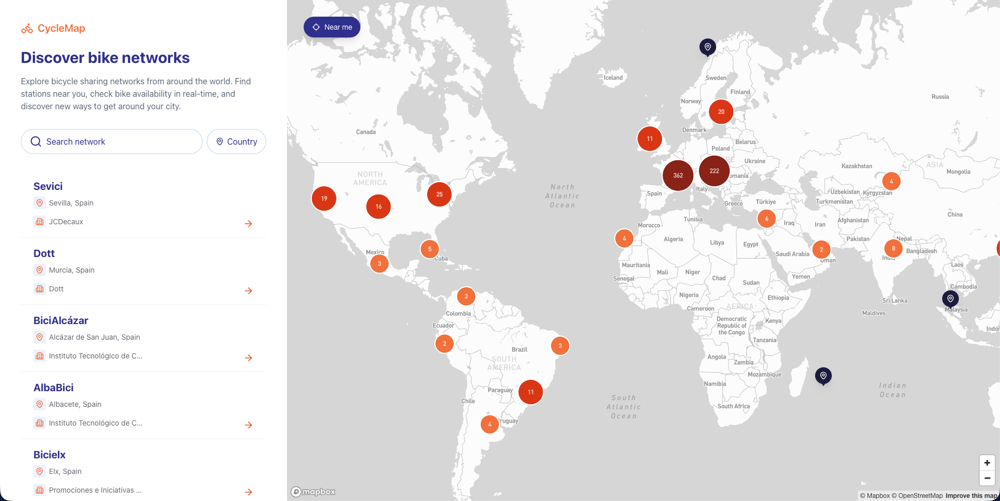
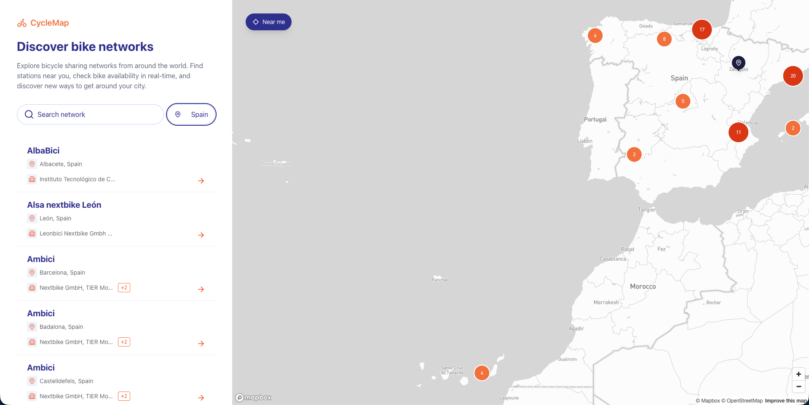
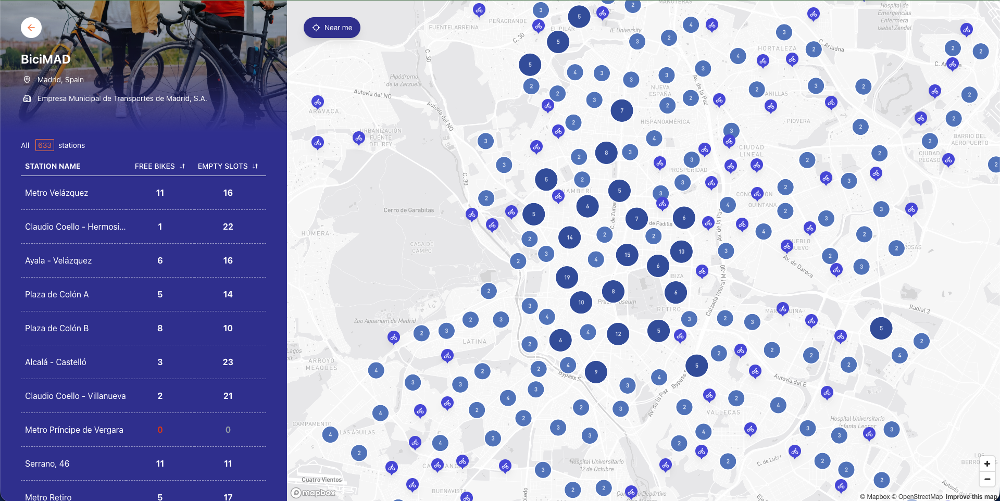
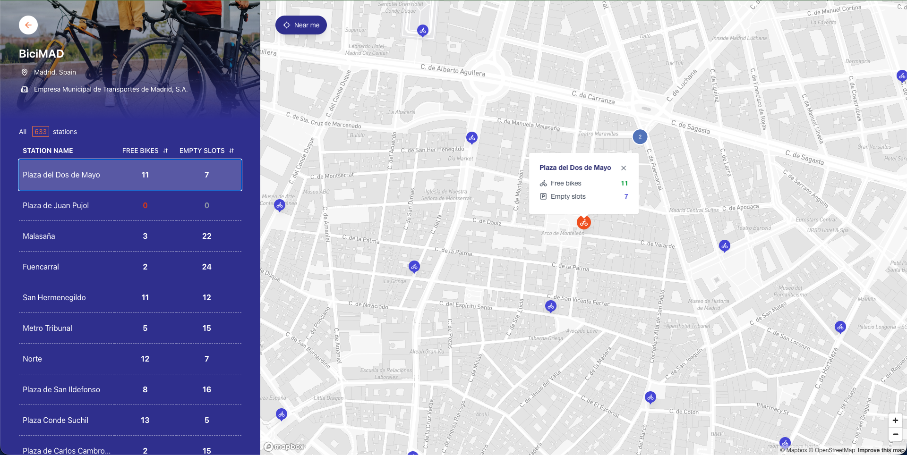

# CycleMap

Explore and discover bicycle sharing networks around the world. Find bike stations, check real-time availability, and plan your ride using an interactive map.

      [](https://github.com/mitoperni/cyclemap/actions/workflows/ci.yml) [](https://cyclemap-rho.vercel.app/)

**[Live Demo](https://cyclemap-rho.vercel.app/)** | **[Design (Figma)](https://www.figma.com/proto/0MNqMneHvxahQZ6pknjzlq/Frontend-Challenge?page-id=1166%3A4310&node-id=5110-10913&viewport=4865%2C-2607%2C0.79&t=UlhDbVzZT1c5dezR-1&scaling=scale-down&content-scaling=fixed&starting-point-node-id=5110%3A10913)**

---

## Table of Contents

- [About](#about)
- [Screenshots](#screenshots)
- [Features](#features)
- [Tech Stack](#tech-stack)
- [Getting Started](#getting-started)
- [Available Scripts](#available-scripts)
- [Project Structure](#project-structure)
- [Architecture & Key Decisions](#architecture--key-decisions)
- [API Reference](#api-reference)
- [Testing](#testing)
- [CI/CD](#cicd)
- [Accessibility](#accessibility)
- [Performance](#performance)
- [Challenges & Trade-offs](#challenges--trade-offs)
- [Git Workflow](#git-workflow)

---

## About

CycleMap is a React SPA built as a **Mid/Senior frontend coding challenge**. It displays bicycle sharing networks from around the world on an interactive map, powered by the [CityBikes API](https://api.citybik.es/v2/).

The application implements **all required features and all bonus features** from the challenge specification, including map integration, search, country filtering, pagination, geolocation, and station sorting.

### Screenshots

**Main View** - World map with network list and search/filter sidebar



**Filtered View** - Networks filtered by country (Spain) with map centered



**Network Detail** - BiciMAD stations table with map and availability data



**Station Popup** - Station details popup showing free bikes and empty slots



---

## Features

### Main View

- **Interactive world map** displaying all bicycle sharing networks with clustered markers
- **Network list sidebar** showing name, city, country, and operating companies
- **Search** across network names and company names, persisted in URL (`?search=velib`)
- **Country filter** with accessible combobox dropdown, persisted in URL (`?country=FR`)
- **Pagination** with URL state persistence (`?page=2`)
- **Near Me** button that geolocates the user, centers the map, and sorts networks by proximity

### Detail View

- **Network information**: name, companies, city, and country
- **Stations table** with all stations in the network, showing free bikes and empty slots
- **Sortable columns** (free bikes, empty slots) in ascending and descending order
- **Station map** with clustering and popups showing station details on click
- **Back button** to return to the main view

### Additional

- Fully responsive layout (sidebar collapses on mobile)
- SEO optimized with Open Graph, Twitter cards, JSON-LD structured data, and dynamic sitemap
- Accessible: ARIA patterns, keyboard navigation, semantic HTML
- Static generation for 35 popular networks via ISR

---

## Tech Stack

| Technology                   | Purpose                                            |
| ---------------------------- | -------------------------------------------------- |
| **Next.js 16** (App Router)  | Server components, ISR, file-based routing         |
| **React 19**                 | UI framework with latest concurrent features       |
| **TypeScript 5**             | End-to-end type safety                             |
| **Tailwind CSS v4**          | Utility-first styling with CSS-first configuration |
| **Mapbox GL** / react-map-gl | Performant vector tile maps with clustering        |
| **Zod**                      | Runtime validation of all API responses            |
| **Radix UI Popover**         | Accessible popover primitive for country select    |
| **Vitest**                   | Fast unit testing with jsdom                       |
| **Husky** + Commitlint       | Git hooks and conventional commit enforcement      |

---

## Getting Started

### Prerequisites

- Node.js 20+
- npm
- A [Mapbox account](https://account.mapbox.com/)

### Installation

```bash
# Clone the repository
git clone https://github.com/mitoperni/cyclemap.git
cd cyclemap

# Install dependencies
npm install

# Set up environment variables
cp .env.example .env.local
```

### Environment Variables

| Variable                   | Description                                                                   |
| -------------------------- | ----------------------------------------------------------------------------- |
| `NEXT_PUBLIC_MAPBOX_TOKEN` | Your Mapbox public access token ([get one here](https://account.mapbox.com/)) |
| `NEXT_PUBLIC_BASE_URL`     | Base URL for the app (`http://localhost:3000` for development)                |
| `NEXT_PUBLIC_USE_REAL_MAP` | Set to `true` to render the Mapbox map                                        |

### Run the Development Server

```bash
npm run dev
```

Open [http://localhost:3000](http://localhost:3000).

---

## Available Scripts

| Command                 | Description                             |
| ----------------------- | --------------------------------------- |
| `npm run dev`           | Start development server with Turbopack |
| `npm run build`         | Build for production                    |
| `npm run start`         | Start production server                 |
| `npm run lint`          | Run ESLint                              |
| `npm run format`        | Format with Prettier                    |
| `npm run type-check`    | Run TypeScript type checking            |
| `npm run validate`      | Run type-check, lint, and tests         |
| `npm test`              | Run tests in watch mode                 |
| `npm run test:ui`       | Run tests with Vitest UI                |
| `npm run test:coverage` | Run tests with coverage report          |

---

## Project Structure

```
src/
├── app/                              # Next.js App Router pages
│   ├── page.tsx                      # Home - Map + network list sidebar
│   ├── layout.tsx                    # Root layout with metadata & fonts
│   ├── globals.css                   # Global styles & Tailwind
│   ├── loading.tsx                   # Global loading state
│   ├── error.tsx                     # Global error boundary
│   ├── sitemap.ts                    # Dynamic sitemap generation
│   ├── robots.ts                     # Robots.txt configuration
│   ├── manifest.ts                   # PWA manifest
│   └── network/[id]/                 # Network detail pages
│       ├── page.tsx                  # Server component with data fetching
│       ├── network-detail-client.tsx # Client component with interactivity
│       ├── loading.tsx               # Network loading skeleton
│       ├── error.tsx                 # Network error boundary
│       └── not-found.tsx             # 404 for invalid network IDs
├── components/
│   ├── map/                          # Mapbox map components
│   │   ├── mapbox-map.tsx            # Main map implementation
│   │   ├── map-container.tsx         # Dynamic import wrapper (lazy loading)
│   │   ├── cluster-markers.tsx       # Network clustering on map
│   │   ├── network-pin.tsx           # Individual network marker
│   │   ├── map-skeleton.tsx          # Animated map loading placeholder
│   │   ├── map-error.tsx             # Map error state
│   │   ├── map-placeholder.tsx       # Map placeholder (dev mode)
│   │   ├── user-location-marker.tsx  # User geolocation marker
│   │   └── stations/                 # Station map (detail view)
│   │       ├── stations-map.tsx      # Station map implementation
│   │       ├── stations-map-container.tsx  # Dynamic import wrapper
│   │       ├── station-cluster-markers.tsx # Station clustering on map
│   │       ├── station-pin.tsx       # Individual station marker
│   │       └── station-popup.tsx     # Station details popup
│   ├── networks/                     # Network list components
│   │   ├── network-sidebar.tsx       # Sidebar container
│   │   ├── network-list.tsx          # Paginated network list
│   │   ├── network-card.tsx          # Individual network card
│   │   ├── network-filters.tsx       # Search + country filter
│   │   ├── network-list-skeleton.tsx # Network list loading placeholder
│   │   └── networks-intro.tsx        # Networks section header
│   ├── stations/                     # Station table components
│   │   ├── stations-table.tsx        # Sortable stations table
│   │   ├── stations-header.tsx       # Table header with sort controls
│   │   ├── station-row.tsx           # Individual station row
│   │   └── stations-table-skeleton.tsx # Stations table loading placeholder
│   ├── ui/                           # Reusable UI primitives
│   │   ├── input.tsx                 # Text input component
│   │   ├── country-select.tsx        # Accessible combobox dropdown
│   │   ├── pagination.tsx            # Pagination controls
│   │   ├── pagination-item.tsx       # Page number button
│   │   ├── previous-pagination.tsx   # Previous page button
│   │   ├── next-pagination.tsx       # Next page button
│   │   ├── near-me-button.tsx        # Geolocation button
│   │   ├── sort-icon.tsx             # Sort direction indicator
│   │   ├── sidebar-open-button.tsx   # Mobile sidebar open trigger
│   │   └── sidebar-close-button.tsx  # Mobile sidebar close trigger
│   ├── layout/                       # Layout components
│   │   ├── sidebar.tsx               # Collapsible sidebar
│   │   └── header.tsx                # App header
│   └── seo/
│       └── json-ld.tsx               # Structured data for SEO
├── contexts/                         # React Context providers
│   ├── filtered-networks-context.tsx # Search, filter & pagination state
│   ├── geolocation-context.tsx       # User location with permission handling
│   ├── sidebar-context.tsx           # Sidebar open/close state
│   └── stations-sync-context.tsx     # Station selection & sorting sync
├── hooks/                            # Custom React hooks
│   ├── use-url-params.ts             # URL search params management
│   ├── use-fit-bounds.ts             # Map bounds fitting
│   ├── use-map-language.ts           # Map label localization
│   └── use-sidebar.ts               # Sidebar state hook
├── lib/
│   ├── api/                          # API client functions
│   │   ├── networks.ts               # Fetch & filter all networks
│   │   └── network-detail.ts         # Fetch individual network with stations
│   ├── schemas/                      # Zod validation schemas
│   │   └── network.ts                # Network & station schemas
│   ├── utils.ts                      # Utility functions (distance, pagination, etc.)
│   └── constants.ts                  # App-wide configuration & constants
├── types/
│   └── index.ts                      # TypeScript type definitions
└── data/
    └── countries.json                # Country code to name mappings

# Barrel exports (index.ts) and test files (__tests__/) omitted for brevity.
# Tests are co-located next to the code they cover.
```

---

## Architecture & Key Decisions

### Server Components by Default

Data fetching happens on the server using Next.js async server components. Client components (`"use client"`) are only used where browser APIs or interactivity are required (maps, forms, filters, geolocation).

### URL-based State Management

Search parameters (`?search=`, `?country=`, `?page=`) serve as the single source of truth for filter state. This makes filters shareable via URL and resilient to page refreshes, without requiring a global state library.

### React Context for UI State

Four focused contexts manage client-side state:

- **FilteredNetworksContext** - Coordinates search, filter, and pagination across the sidebar and map
- **GeolocationContext** - Handles user location with permission management and error states
- **SidebarContext** - Manages sidebar open/close for responsive layouts
- **StationsSyncContext** - Syncs selected station between table and map, manages sort state

### ISR + Static Generation

35 popular networks are pre-built at deploy time via `generateStaticParams`. Other networks are generated on-demand with Incremental Static Regeneration. Network list caches for 24 hours, individual network details for 1 minute.

### Zod Schema Validation

All API responses are validated at runtime with Zod schemas before being used in the application. This catches API shape changes early and provides type narrowing.

### Lazy Loading the Map

Mapbox GL is loaded via dynamic imports (`next/dynamic`) to keep the initial bundle small. A skeleton placeholder is shown while the map loads.

### Clustering

Both network markers (main view) and station markers (detail view) use clustering to maintain performance when rendering hundreds of points on the map. Clusters are color-coded by size.

### Custom UI Components

The challenge specifies Shadcn/ui. Instead, all UI components are custom-built with Tailwind CSS, with the single exception of the country select dropdown which uses `@radix-ui/react-popover` for accessible popover positioning. This provided full control over styling while maintaining accessibility patterns (ARIA combobox, keyboard navigation, focus management).

---

## API Reference

This project uses the [CityBikes API](https://api.citybik.es/v2/) for bicycle sharing network data.

### Endpoints Used

| Endpoint                     | Description                                 | Cache |
| ---------------------------- | ------------------------------------------- | ----- |
| `GET /networks`              | List all bicycle sharing networks worldwide | 24 h  |
| `GET /networks/{network_id}` | Get network details with all stations       | 1 min |

The API does not support server-side pagination or filtering, so all filtering, searching, and pagination is implemented client-side after fetching the full dataset.

---

## Testing

Testing is done with **Vitest** and **React Testing Library**.

```bash
npm test                 # Watch mode
npm run test:coverage    # With coverage report
npm run test:ui          # Vitest UI dashboard
```

### What is tested

- **API functions** - Network fetching, error handling, data transformation
- **Zod schemas** - Validation of API response shapes
- **Components** - Map components, pagination, near-me button, network pin
- **Hooks** - `useFitBounds`, `useUrlParams`
- **Contexts** - Station sorting synchronization
- **Utilities** - Distance calculations, pagination logic, helper functions

---

## CI/CD

### GitHub Actions Pipeline

On every PR and push to `main`:

1. **Lint** - ESLint + Prettier check
2. **Type Check** - TypeScript compiler
3. **Test** - Vitest with coverage
4. **Build** - Next.js production build (only runs if all checks pass)

### Pre-commit Hooks (Husky)

- **lint-staged**: Runs ESLint and Prettier on staged files
- **commitlint**: Validates commit messages follow [Conventional Commits](https://www.conventionalcommits.org/)

### Deployment

The application is deployed on **Vercel** with automatic deployments on push to `main`.

---

## Accessibility

- **ARIA combobox pattern** in the country select dropdown with full keyboard navigation (Arrow keys, Home, End, Enter, Escape)
- **Semantic HTML** with proper landmarks, roles, and labels
- **Keyboard navigable** throughout the application
- **Screen reader friendly** with `aria-label`, `aria-expanded`, `aria-controls`, and live regions
- **Focus management** for interactive elements

---

## Performance

Lighthouse scores (production deployment, Lighthouse 13.0.1):

| Metric             | Mobile | Desktop |
| ------------------ | ------ | ------- |
| **Performance**    | 96     | 100     |
| **Accessibility**  | 100    | 96      |
| **Best Practices** | 100    | 100     |
| **SEO**            | 100    | 100     |

| Core Web Vital           | Mobile | Desktop |
| ------------------------ | ------ | ------- |
| First Contentful Paint   | 1.2s   | 0.3s    |
| Largest Contentful Paint | 2.6s   | 0.6s    |
| Total Blocking Time      | 50ms   | 0ms     |
| Cumulative Layout Shift  | 0      | 0       |

### Optimization Strategies

**Loading & Bundle**

- Mapbox GL loaded via `next/dynamic` with `ssr: false` and skeleton fallbacks to keep the initial bundle lean
- Google Fonts optimized through `next/font` with `display: 'swap'` to eliminate render-blocking requests
- Preconnect hints to Mapbox CDN domains for faster map tile loading

**Rendering**

- Extensive memoization (`useMemo`, `useCallback`, `React.memo`) across components and contexts to minimize unnecessary re-renders
- Debounced inputs and map events at multiple levels (search, map panning, cluster updates, window resize)
- `requestAnimationFrame`-batched cluster marker updates for smooth map interactions
- Ref-based state tracking to avoid triggering renders for internal bookkeeping

**Caching & Data**

- ISR with static generation for popular networks via `generateStaticParams`, on-demand generation for the rest
- React `cache()` for server-side request deduplication during rendering
- Tiered revalidation: network list cached longer, station data refreshed more frequently

**Map Performance**

- Mapbox GL native clustering for both network and station markers, with zoom-based expansion
- WebGL map instance reuse (`reuseMaps`) to avoid costly context re-creation on navigation

---

## Challenges & Trade-offs

### CityBikes API Limitations

The API returns all networks in a single response without pagination or filtering support. This meant implementing client-side search, filtering, and pagination. For a production application, a BFF (Backend for Frontend) layer could proxy and cache the API with proper pagination support.

### Map Library Choice

**Mapbox GL** was chosen over Leaflet for its superior performance with vector tiles and built-in clustering support. The trade-off is requiring an API token, but the free tier is generous for development and demo purposes.

### State Architecture

Rather than introducing a global state library (Redux, Zustand), the application uses a combination of URL search params for shareable filter state and focused React Contexts for UI coordination. This keeps the architecture simple while ensuring filters survive page refreshes and can be shared via URL.

### Server vs Client Components

The challenge was finding the right boundary. Data fetching and initial rendering happen in server components for performance, while map rendering, form interactions, and geolocation require client components. The network detail page demonstrates this pattern: the server component fetches data, and a client component handles all interactivity.

---

## Git Workflow

### Commit Message Format

```
<type>: <subject>

Types: feat, fix, docs, style, refactor, perf, test, build, ci, chore, revert
```

Examples:

```bash
git commit -m "feat: add user authentication"
git commit -m "fix: handle network timeout errors"
git commit -m "docs: update README with git workflow"
```
